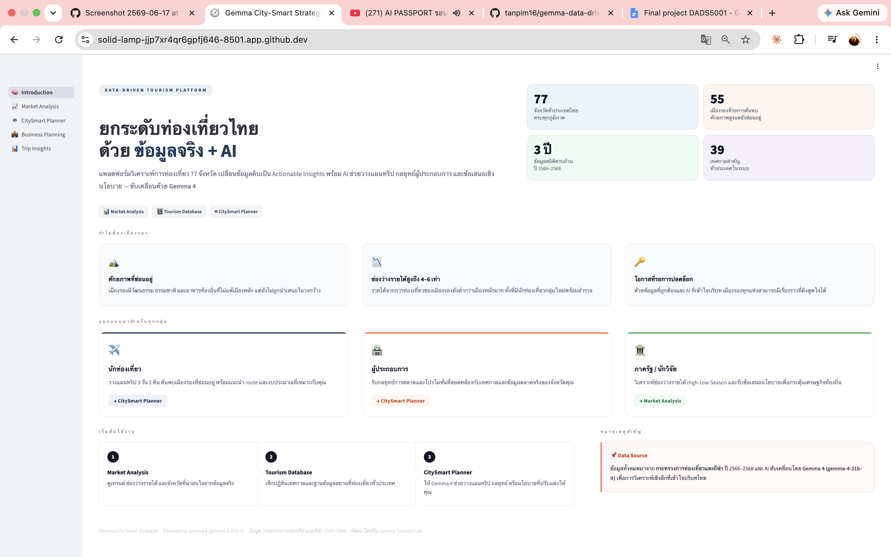
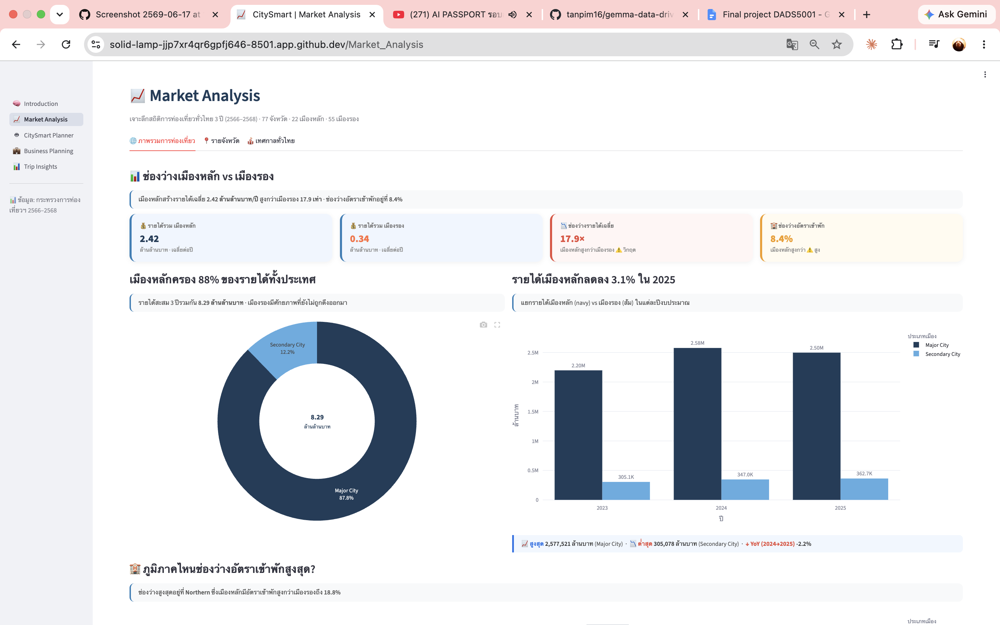
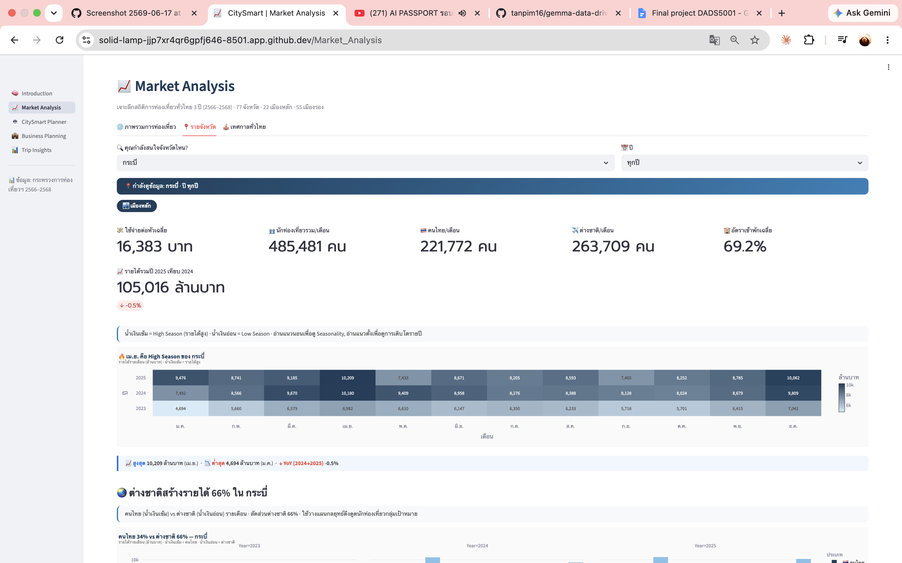
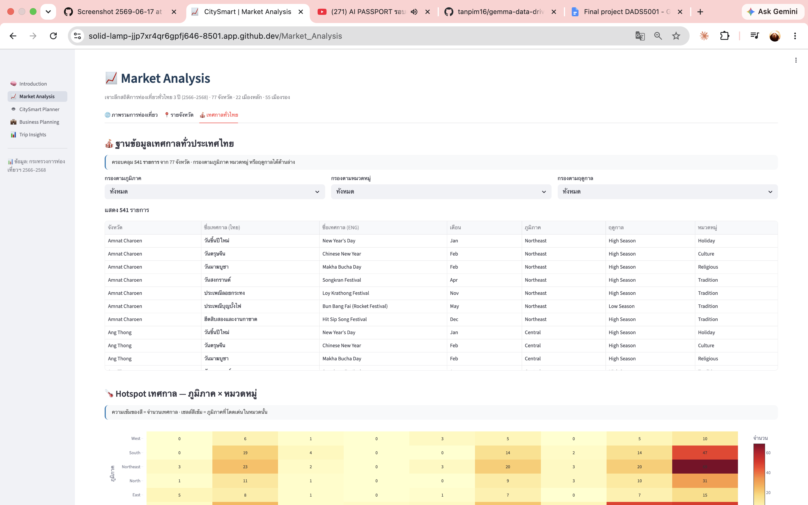
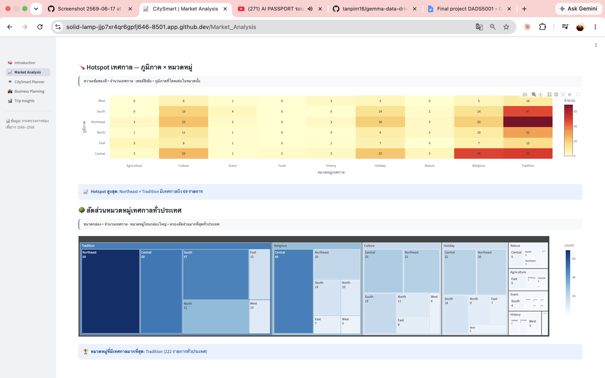
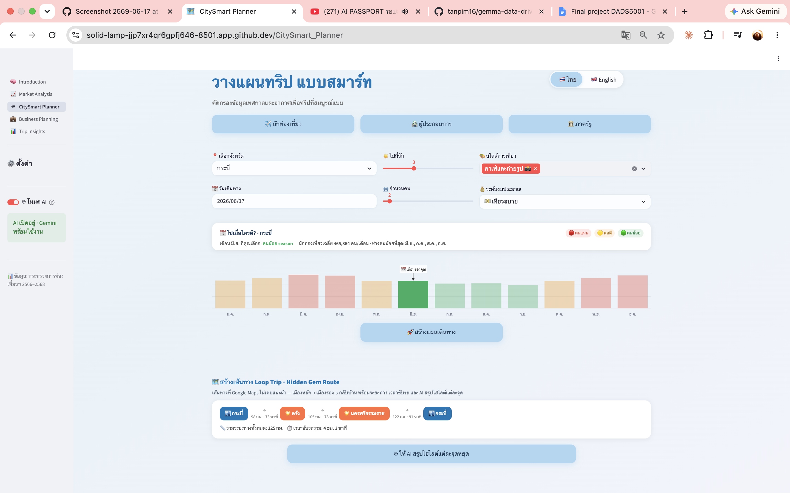
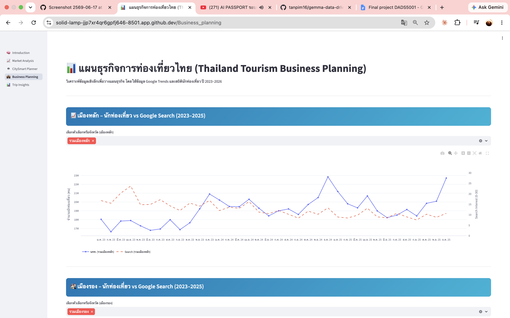
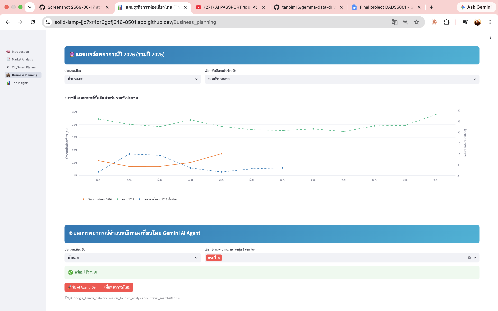
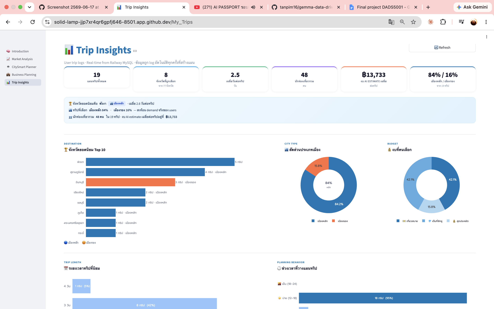

<div align="center">

# 🧭 Gemma City-Smart Strategist
### ยกระดับการท่องเที่ยวไทยด้วยข้อมูลจริง + AI

**A Data-Driven Tourism Platform for Thailand's 55 Secondary Cities**

แพลตฟอร์มวิเคราะห์การท่องเที่ยว 77 จังหวัด ที่เปลี่ยนข้อมูลดิบให้เป็น *Actionable Insights*
พร้อมผู้ช่วย AI (Gemma 4) สำหรับวางแผนทริป กลยุทธ์ผู้ประกอบการ และข้อเสนอเชิงนโยบาย

`🎈 Streamlit`  ·  `🤖 Gemma 4`  ·  `🦆 DuckDB`  ·  `🐍 Python 3.11+`

🔗 **Live Demo:** https://gemma-tourism-project-genzapp-dads5001-2-2026.streamlit.app

</div>

---

## 🌟 ภาพรวมโครงการ (Project Overview)

รายได้จากการท่องเที่ยวของไทยกระจุกตัวอยู่ที่ **เมืองหลัก** ขณะที่ **เมืองรองทั้ง 55 จังหวัด** มีศักยภาพสูงแต่ยังถูกมองข้าม — ช่องว่างรายได้ระหว่างเมืองหลักกับเมืองรองสูงถึง **4–6 เท่า**

โครงการนี้เป็น **Data-Centric Web Application** ที่รวม **ข้อมูลสถิติการท่องเที่ยวจริง (2566–2568)**, **ฐานข้อมูลเทศกาลที่จัดทำขึ้นเอง (39+ งาน)** และ **Google Trends** เข้ากับ **Generative AI (Gemma 4)** เพื่อช่วยให้ทั้งนักท่องเที่ยว ผู้ประกอบการ และภาครัฐ ตัดสินใจได้บนพื้นฐานของข้อมูล

> **เป้าหมาย:** ลดช่องว่างระหว่าง *ข้อมูลดิบ* กับ *กลยุทธ์ที่ลงมือทำได้จริง* และกระจายรายได้สู่ชุมชนเมืองรอง

---

## 🚀 ฟีเจอร์หลัก (Key Features)

แอปทำงานแบบ **Multi-page** (5 หน้า) และมี **2 โหมด** ในทุกหน้า — *Non-AI (Dashboard)* และ *AI (Smart Consultant)*

| # | หน้า (Page) | คำอธิบาย |
|---|------------|----------|
| 🧠 | **Introduction** | หน้าภาพรวมโครงการ · สถิติเด่น · เส้นทางการใช้งานสำหรับแต่ละกลุ่มผู้ใช้ |
| 📈 | **Market Analysis** | แดชบอร์ดวิเคราะห์ตลาด — ช่องว่างรายได้เมืองหลัก/เมืองรอง, ผลกระทบเทศกาลต่อรายได้, เทรนด์รายปี (DuckDB + Plotly) |
| 🤖 | **CitySmart Planner** | ผู้ช่วย AI 3 บทบาท: **นักท่องเที่ยว** (วางแผนทริป + Loop Trip เมืองรอง + พยากรณ์อากาศ + แผนที่ + Export PDF), **ผู้ประกอบการ** (กลยุทธ์การตลาด), **ภาครัฐ** (ข้อเสนอเชิงนโยบาย) |
| 💼 | **Business Planning** | วิเคราะห์เชิงลึกด้วย Google Trends เทียบกับสถิตินักท่องเที่ยว เพื่อวางแผนธุรกิจรายจังหวัด |
| 📊 | **Trip Insights** | แดชบอร์ดสรุปแผนทริปที่ผู้ใช้สร้าง — จังหวัดยอดนิยม, งบประมาณ, ระยะเวลา, เมืองหลัก vs เมืองรอง |

**ไฮไลต์ที่น่าสนใจ**
- 🗺️ **Loop Trip · Hidden Gem Route** — สร้างเส้นทางเมืองหลัก → เมืองรอง → กลับบ้าน พร้อมระยะทาง/เวลาขับรถ และ AI สรุปไฮไลต์แต่ละจุด
- 🎉 **Deep Event Analysis** — เชื่อมโยงรายได้การท่องเที่ยวกับเทศกาล 39+ งานทั่วประเทศ
- 🌦️ **Weather-aware Planning** — แผนทริปคำนึงถึงสภาพอากาศของแต่ละจังหวัด
- 📄 **PDF Export** — ดาวน์โหลดแผนเดินทาง (รองรับฟอนต์ไทย Sarabun)
- 🌐 **2 ภาษา** — ไทย / English

---

## 🖼️ ตัวอย่างหน้าจอ (Screenshots)

### 🧠 Introduction


### 📈 Market Analysis





### 🤖 CitySmart Planner


### 💼 Business Planning



### 📊 Trip Insights


---

## 🏗️ สถาปัตยกรรมระบบ (Architecture)

```
                ┌──────────────────────────────────────────────┐
   Data Sources │  Tourism Stats · Festival Master · G-Trends   │
                └──────────────────────┬───────────────────────┘
                                       │  (ETL / Scheduler)
                   ┌───────────────────▼────────────────────┐
   Storage Layer   │  ❄️ Snowflake  ──fallback──▶  📄 Local CSV │
                   │  🍃 MongoDB (pipeline)  ·  🐬 MySQL (logs) │
                   └───────────────────┬────────────────────┘
                                       │
                          ┌────────────▼────────────┐
   Query Engine           │   🦆 DuckDB  +  Pandas    │
                          └────────────┬────────────┘
                                       │
            ┌──────────────────────────┼──────────────────────────┐
            ▼                          ▼                           ▼
   📈 Analytics (Plotly)     🤖 Gemma 4 Consultant        📄 PDF / 🗺️ Maps
            └──────────────────────────┼──────────────────────────┘
                                       ▼
                          🖥️ Streamlit Multi-page UI
```

**Data flow ที่สำคัญ:** Streamlit `session_state` ทำหน้าที่ส่งต่อบริบทข้อมูล (จังหวัด/สไตล์/งบ) จากแดชบอร์ดไปยัง AI เพื่อให้คำแนะนำที่ *personalized* ต่อผู้ใช้แต่ละคน

---

## 🛠️ Tech Stack

| ด้าน | เทคโนโลยี |
|------|-----------|
| **Frontend / App** | [Streamlit](https://streamlit.io/) (multi-page navigation) |
| **AI Model** | Google **Gemma 4** (`gemma-4-31b-it`) ผ่าน `google-generativeai` |
| **Query Engine** | [DuckDB](https://duckdb.org/) + Pandas / NumPy |
| **Data Warehouse** | [Snowflake](https://www.snowflake.com/) (fallback เป็น Local CSV อัตโนมัติ) |
| **Databases** | MySQL (บันทึกแผนทริป) · MongoDB (data pipeline) |
| **Visualization** | [Plotly](https://plotly.com/) |
| **External Data** | Google Trends (`pytrends`) |
| **Scheduling** | `schedule` (data refresh) |

---

## 📚 แหล่งข้อมูล (Data Sources)

- **สถิติการท่องเที่ยว ปี 2566–2568** — กระทรวงการท่องเที่ยวและกีฬา (`master_tourism_analysis.csv`)
- **Thailand Festival Master Dataset** — ฐานข้อมูลเทศกาล 39+ งาน พร้อม Economic Impact score (จัดทำเอง)
- **Google Trends** — ความสนใจการค้นหารายจังหวัด (`Google_Trends_Data.csv`, `Travel_search2026.csv`)

---

## 📂 โครงสร้างโปรเจกต์ (Project Structure)

```
gemma-data-driven-tourism-project/
├── app.py                       # Entry point — Streamlit navigation
├── intro.py                     # 🧠 หน้า Introduction (ภาพรวมโครงการ)
├── pages/
│   ├── 1_Market_Analysis.py     # 📈 แดชบอร์ดวิเคราะห์ตลาด
│   ├── 2_CitySmart_Planner.py   # 🤖 ผู้ช่วย AI (นักท่องเที่ยว/ผู้ประกอบการ/ภาครัฐ)
│   ├── 3_Business_planning.py   # 💼 วางแผนธุรกิจด้วย Google Trends
│   └── 4_My_Trips.py            # 📊 Trip Insights dashboard
├── utils/
│   ├── snowflake_connector.py   # เชื่อมต่อ Snowflake (+ fallback CSV)
│   ├── mysql_connector.py       # บันทึก/ดึงแผนทริป
│   └── upload_to_snowflake.py   # สคริปต์ ETL อัปโหลดข้อมูล
├── data/                        # Datasets + data-pipeline scripts
├── .streamlit/secrets.toml      # 🔒 API keys / DB credentials (gitignored)
└── requirements.txt
```

---

<div align="center">

**Gemma City-Smart Strategist** · Powered by Google Gemma 4
ข้อมูล: กระทรวงการท่องเที่ยวและกีฬา 2566–2568

</div>
